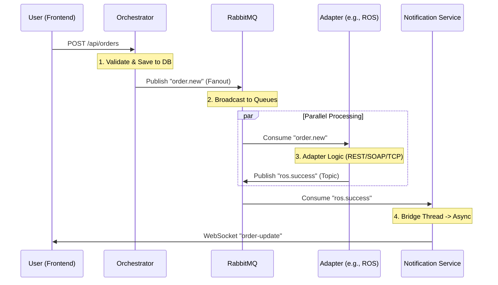

# SwiftLogistics System Reference Manual

**Version:** 2.0.0
**Last Updated:** February 2026

---

## 1. Executive Summary

SwiftLogistics is a middleware platform designed to modernize logistics operations for Swift Logistics (Pvt) Ltd. It acts as a central nervous system, integrating legacy Customer Management Systems (CMS), modern Route Optimization Systems (ROS), and proprietary Warehouse Management Systems (WMS).

The system enables:

- **Real-time Order Processing:** Event-driven architecture handling high volumes.
- **Protocol Unification:** Integration of SOAP, REST, and TCP services.
- **Live Tracking:** WebSocket updates for drivers and clients.

---

## 2. System Architecture

### High-Level Components

1.  **Frontend Applications** (Client Portal, Driver App)
2.  **API Gateway** (Entry point, Auth, Ratelimiting)
3.  **Orchestrator** (Business Logic, State Management)
4.  **Message Broker** (RabbitMQ for async communication)
5.  **Adapters** (Protocol translation for CMS, ROS, WMS)
6.  **External/Mock Services** (The actual endpoint systems)
7.  **Notification Service** (Real-time WebSocket push)

### Technology Stack

- **Backend:** Python 3.13+, FastAPI
- **Database:** MongoDB
- **Messaging:** RabbitMQ
- **Frontend:** React, React Native (Planned)
- **Infrastructure:** Docker, Docker Compose

---

## 3. Deployment & Operations

### Prerequisites

- Docker & Docker Compose
- Make (Optional, but recommended)

### Quick Start

The entire system can be managed using the `Makefile` in the root directory.

```bash
# Start all services
make start

# View logs
make logs

# Check health
make test

# Stop everything
make stop
```

### Manual Start

If `make` is not available:

```bash
./scripts/start-all.sh
```

---

## 4. Service Catalog

For detailed technical specifications of each service, refer to the `docs/services/` directory:

- **[API Gateway](services/api_gateway.md):** Entry point and security.
- **[Orchestrator](services/orchestrator.md):** Order lifecycle management.
- **[Notification Service](services/notification_service.md):** Real-time updates.
- Adapters:
  - **[CMS Adapter](services/cms_adapter.md):** SOAP integration.
  - **[ROS Adapter](services/ros_adapter.md):** REST integration.
  - **[WMS Adapter](services/wms_adapter.md):** TCP integration.
- Mocks:
  - **[CMS Mock](services/mock_cms.md)**
  - **[ROS Mock](services/mock_ros.md)**
  - **[WMS Mock](services/mock_wms.md)**

---

## 5. Development Workflow

To add a new feature:

1.  **Update API Gateway:** Add routes in `services/api-gateway/routes`.
2.  **Update Orchestrator:** Add logic in `services/orchestrator/routes`.
3.  **Define Events:** If async, add event types in RabbitMQ exchanges.
4.  **Update Adapters:** If external systems are involved, update the relevant adapter.

---

## 6. Project Structure

```
SwiftLogistics/
├── docs/               # Documentation
│   ├── services/       # Technical Service Docs
│   └── SYSTEM_REFERENCE_MANUAL.md
├── services/           # Source Code
│   ├── api-gateway/
│   ├── orchestrator/
│   ├── notification-service/
│   ├── adapters/
│   └── mocks/
├── scripts/            # Helper scripts (start, test, setup)
├── Makefile            # Main management command
└── docker-compose.yml  # Container orchestration
```

---

## 7. Troubleshooting

- **Service Fails to Start:** Check ports (3000-3003, 4000-4002, 5672, 27017). Stop other services using these ports.
- **RabbitMQ Connection Error:** Ensure RabbitMQ container is healthy before services start (Scripts handle this wait).
- **Database Error:** Ensure MongoDB is running. connection string format: `mongodb://mongodb:27017/swiftlogistics`.

---

## 8. Technical Deep Dive

### 8.1 API Gateway Internals & Security

The API Gateway (`services/api-gateway`) is the security shield of the platform.

#### Authentication Flow (JWT)

1.  **Login Request:** User POSTs credentials to `/api/auth/login`.
2.  **Verification:** Gateway hashes password with **bcrypt** and compares with stored hash from CMS Mock.
3.  **Token Generation:** If valid, generates a **JSON Web Token (JWT)** using `python-jose`.
    - **Algorithm:** HS256 (HMAC with SHA-256)
    - **Payload:** `sub` (user_id), `role`, `exp` (expiration).
    - **Secret:** `SECRET_KEY` env var.
4.  **Protected Routes:** Middleware intercepts requests.
    - Extracts `Authorization: Bearer <token>`.
    - Decodes and verifies signature.
    - Injects `user_id` into `request.state`.

#### Validation & Networking

- **Input Validation:** Uses **Pydantic** models to strictly validate JSON payloads (types, constraints) before processing.
- **Rate Limiting:** **SlowAPI** tracks request IP addresses in memory to prevent abuse (e.g., `5/minute`).
- **CORS:** Configured to allow requests from the Frontend URL (`http://localhost:5173`).

### 8.2 Data Flow: The "Place Order" Journey

Tracing a data packet through the system:

1.  **Frontend**: User clicks "Submit". React sends `POST /api/orders` with JSON body.
2.  **Gateway**:
    - Validates JWT.
    - Checks Rate Limit.
    - Forwards request to **Orchestrator** (`http://orchestrator:3001`).
3.  **Orchestrator**:
    - Generates internal `order_id`.
    - Saves initial state (`RECEIVED`) to **MongoDB**.
    - Publishes message to **RabbitMQ** exchange `order_exchange`.
    - Returns **202 Accepted** immediately to Gateway -> Frontend.
4.  **RabbitMQ (Fanout)**:
    - Copies message to 3 queues: `cms_queue`, `ros_queue`, `wms_queue`.
5.  **Adapters (Parallel Processing)**:
    - **CMS Adapter:** Reads queue -> Transforms to SOAP -> Calls CMS Mock.
    - **ROS Adapter:** Reads queue -> Transforms to REST -> Calls ROS Mock.
    - **WMS Adapter:** Reads queue -> Opens TCP Socket -> Calls WMS Mock.
6.  **Feedback Loop**:
    - Adapters receive responses from Mocks.
    - Adapters publish `order_update` events back to RabbitMQ.
7.  **Notification**:
    - Consumes `order_update`.
    - Pushes JSON payload to Frontend via **Socket.IO**.
8.  **Frontend**:
    - Receives WebSocket event.
    - Updates UI Status (e.g., content turns Green).

### 8.3 RabbitMQ Architecture

The system uses a "Pub/Sub" pattern for decoupling.

- **Brokers:** RabbitMQ Server (`rabbitmq:5672`).
- **Exchanges:**
  - `order_exchange` (Type: `fanout`): Broadcasts new orders to all adapters.
  - `events_exchange` (Type: `topic`): Routes updates based on source (e.g., `cms.success`).
- **Queues:**
  - `cms_order_queue`, `ros_order_queue`, `wms_order_queue` (Bound to `order_exchange`).
  - `notification_events_queue` (Bound to `events_exchange`).
- **Reliability:** Usage of **Durable Queues** ensures messages persist if services crash.

### 8.4 User Credential Handling

- **Storage:** Credentials are NOT stored in the gateway. They reside in the **CMS Mock** database (`customers.json`).
- **Hashing:** Passwords are hashed using **bcrypt** (salt rounds auto-handled by `passlib`).
- **Safety:** Plaintext passwords never leave the boundaries of the internal network after the initial HTTPS (simulated) request.

### 8.5 Inter-Container Communication

Docker Compose creates a private network (`custom_network`).

- **Service Discovery:** Containers resolve each other by name.
  - Gateway talks to `http://orchestrator:3001`.
  - Adapters talk to `amqp://rabbitmq:5672`.
- **Isolation:** Only ports `3000-3003` are exposed to host; internal database ports (`27017`) can be kept private if desired (currently exposed for debugging).

---

## 9. Software Design & Implementation Patterns

### 9.1 Concurrency Models

The system employs a hybrid concurrency model to handle different types of workloads:

1.  **Asynchronous I/O (Main Event Loop)**
    - **Services:** API Gateway, Orchestrator
    - **Technology:** Python `asyncio` + FastAPI (Uvicorn).
    - **Pattern:** Non-blocking I/O is used for all HTTP handling. The single-threaded `asyncio` loop ensures high throughput for API requests by yielding control during I/O waits (e.g., waiting for DB or RabbitMQ acknowledgments).

2.  **Multithreading (Background Workers)**
    - **Services:** Adapters (CMS, ROS, WMS), Notification Service.
    - **Technology:** `threading.Thread`.
    - **Reason:** The Pika library (RabbitMQ client) uses a **blocking** connection model (`BlockingConnection`). To ensure the FastAPI health check endpoints remain responsive, the Pika consumer loop runs in a separate daemon thread.
    - **Code Example:**
      ```python
      # Main thread runs FastAPI (Health checks)
      # Background thread runs Pika consumer
      consumer_thread = threading.Thread(target=consume_orders, daemon=True)
      consumer_thread.start()
      ```

3.  **Bridge: Thread -> Async**
    - **Service:** Notification Service.
    - **Challenge:** Pika runs in a Thread, but Socket.IO is Async.
    - **Solution:** Uses `asyncio.run_coroutine_threadsafe` (or similar mechanisms) to bridge the synchronous Pika callback to the asynchronous Socket.IO emit function.

### 9.2 Thread Safety

- **State Isolation:** Each service is designed to be **stateless**. Data is stored in MongoDB or passed via immutable Message Queue events.
- **No Shared Memory:** Since we run in Docker containers, memory is isolated.
- **GIL (Global Interpreter Lock):** In Python, the GIL prevents multiple native threads from executing Python bytecodes at once. While this limits CPU-bound parallelism, it simplifies thread safety.
- **Safe Resourcing:** Database connections (`motor`) and Queue connections (`pika`) are created per-process or per-thread as required. We do NOT share a single socket across threads without locks.

### 9.3 Design Patterns Used

1.  **Orchestration Pattern (Saga-like)**
    - The **Orchestrator Service** is the central authority. It directs the flow but doesn't block waiting for results. It relies on **Eventual Consistency** (e.g., "Order Created" -> "Order Processed").

2.  **Adapter Pattern (Structural)**
    - **Problem:** Mocks/External systems speak different languages (SOAP, TCP, REST).
    - **Solution:** Adapter services wrap these incompatibilities and present a uniform "RabbitMQ JSON Event" interface to the rest of the system.

3.  **Observer Pattern (Pub/Sub)**
    - The **Notification Service** "observes" the `events_exchange`. It doesn't know who produced the event, it just reacts by pushing to the UI.

4.  **Middleware Pattern**
    - Used in the **API Gateway** for Cross-Cutting Concerns such as Rate Limiting (`slowapi`), Auth (`JWT`), and CORS logic before the request hits the actual router.

---

## 10. Event Architecture & Triggers

### 10.1 Event Catalog

| Event Name         | Source       | Trigger Condition                                | Destination (Topics)                                    |
| :----------------- | :----------- | :----------------------------------------------- | :------------------------------------------------------ |
| **`order.new`**    | Orchestrator | User submits `POST /api/orders`                  | `cms_order_queue`, `ros_order_queue`, `wms_order_queue` |
| **`cms.success`**  | CMS Adapter  | Adapter successfully calls CMS SOAP API          | `notification_events_queue`                             |
| **`ros.success`**  | ROS Adapter  | Adapter successfully gets Route from ROS API     | `notification_events_queue`                             |
| **`wms.success`**  | WMS Adapter  | Adapter successfully receives ACK from WMS TCP   | `notification_events_queue`                             |
| **`order.update`** | Any Adapter  | Implementation dependant - generic status update | `notification_events_queue`                             |

### 10.2 Sequence Diagram: Event Trigger Flow



---

## 11. System Best Practices

### 11.1 Security Best Practices

- **Least Privilege:** Internal services (Orchestrator, Adapters) are not exposed to the public internet; only the API Gateway is.
- **Credential Hashing:** User passwords are never stored in plain text. `bcrypt` is used with automatic salt generation.
- **Input Validation:** All incoming data is strictly validated using **Pydantic V2** schemas. Extra fields are forbidden to prevent injection attacks.

### 11.2 Reliability & Fault Tolerance

- **Durable Queues:** RabbitMQ queues are declared as `durable=True`, ensuring messages survive a broker restart.
- **Acknowledgments (ACKs):** Consumers only send an ACK (`ch.basic_ack`) after successfully processing the message. If the worker crashes mid-process, the message is requeued.
- **Dead Letter Handling:** (Planned) Unprocessable messages should be routed to a mechanism for manual inspection.

### 11.3 Code Quality & Maintainability

- **Type Hinting:** Fully leverages Python 3.13+ type hints for better developer experience and generic catching of type errors.
- **Modular Monorepo:** Services are kept in separate folders but share a common `Makefile` and `docker-compose.yml`, simplifying the "Developer Loop".
- **Environment Configuration:** All secrets (URLs, Ports, Credentials) are loaded via `.env` files using `python-dotenv`, keeping configuration separate from code.
